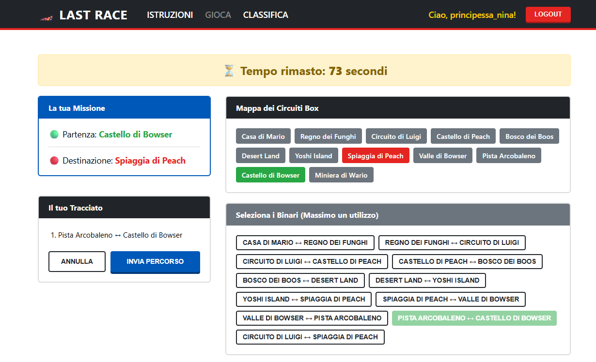
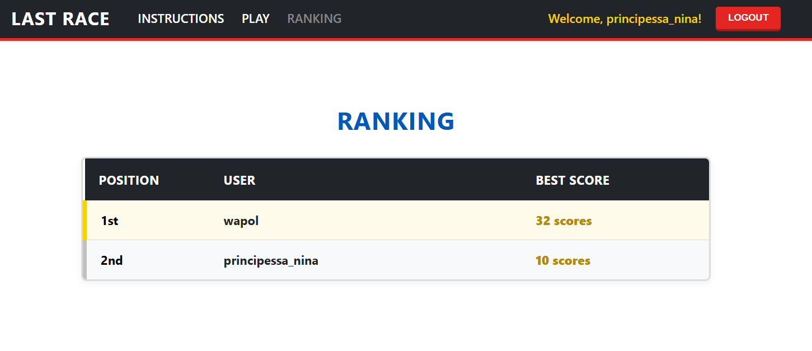

# Exam #N: "Last Race"
## Student: s349342 ROSSI ELENA 

## React Client Application Routes

- Route `/`: It's the landing page of the web application. If the user is not authenticated the page shows only the instructions of the game and the botton for the login, otherwise the page shows the instructions of the game with also a button to start the game, the button to logout and a navigation bar for the ranking page and the game page. 
- Route `/login`: It's the page for the login, there is a form to insert the username and the password. When the login is completed successfully the user is redirected to the home page (/)
- Route `/game`: It's the page of the first phase of the game. It's divided in two blocks: one with the map and one with the stations. On top of the page there is a button to start the game. When the user click on the button the timer starts and it's shows on the top of the page. There are shown also the departure and the arrival stations, the list of the stations and the list of the possible connections, the list of the connections selected by the user with two buttons: one for the submitions of the routes and one for delete the last connection choosen. 
After the submission or when times runs out, if the sumbimission is validate there is shown the route with the events and after the moneys obtained by the user and a button to play again. Otherwise is shown a message of invalidate game with the score 0 and a button to play again. 
- Route `/ranking`: This page is responsable of showing the ranking with the top score for each user. 


## API Server

* **POST `/api/sessions`**: Login a user to establish a new session.
  - **Request body**: JSON object with the user's credentials.
  ```json
    {
      "username": "principessa_nina",
      "password": "password"
    }


**Response body**: JSON object with the safe user details or an array of validation errors.

```json
  {
    "id": 1,
    "username": "principessa_nina"
  }

```

* **Codes**: `200 OK`, `401 Unauthorized`, `422 Unprocessable Entity`.

* **GET `/api/sessions/current**`: Check if the current user has an active session (useful for page reloads).
* **Request body**: *None*
* **Response body**: JSON object with the logged-in user details.


```json
  {
    "id": 1,
    "username": "principessa_nina"
  }

```


* **Codes**: `200 OK`, `401 Unauthorized`.


* **DELETE `/api/sessions/current**`: Logout the current user and destroy the active session.
* **Request body**: *None*
* **Response body**: Empty JSON object.


```json
  {}

```


* **Codes**: `200 OK`.


* **GET `/api/network**`: Retrieve the complete railway network map (stations, lines, and connections). Requires the user to be logged in.
* **Request body**: *None*
* **Response body**: JSON object containing arrays of stations, lines, and their connections.


```json
  {
    "stations": [
      { "id": 1, "name": "Mario House" },
      { "id": 2, "name": "Mushroom Kingdom" }
    ],
    "lines": [
      { "id": 1, "name": "Toad Line", "color": "Red" }
    ],
    "connections": [
      { "id": 1, "station_a_id": 1, "station_b_id": 2, "line_id": 1 }
    ]
  }

```


* **Codes**: `200 OK`, `401 Unauthorized`, `500 Internal Server Error`.


* **GET `/api/ranking**`: Retrieve the global player ranking. Requires the user to be logged in.
* **Request body**: *None*
* **Response body**: JSON array containing the ranked list of players and their top scores.


```json
  [
    { "username": "wapol", "top_score": 32 },
    { "username": "principessa_nina", "top_score": 10 }
  ]

```


* **Codes**: `200 OK`, `401 Unauthorized`, `500 Internal Server Error`.


* **POST `/api/games/start**`: Start a new game instance. Automatically generates a valid start and destination station at least 3 segments apart and saves the active game state in the user's session. Requires the user to be logged in.
* **Request body**: *None*
* **Response body**: JSON object containing the assigned departure, destination, and the map connections.


```json
  {
    "partenza": { "id": 1, "name": "Mario House" },
    "destinazione": { "id": 5, "name": "Boo Woods" },
    "connections": [
      { "id": 1, "station_a_id": 1, "station_b_id": 2, "line_id": 1 }
    ]
  }

```


* **Codes**: `200 OK`, `401 Unauthorized`, `500 Internal Server Error`.


* **POST `/api/games/validate**`: Validate the path chosen by the player, calculate the final score (applying random events/modifiers), and save the result to the database. Requires an active game session and the user to be logged in.
* **Request body**: JSON object containing the chosen path as an array of connection segment objects.


```json
  {
    "percorso": [
      { "id": 1 },
      { "id": 2 },
      { "id": 3 }
    ]
  }

```


* **Response body**: JSON object detailing whether the path was valid, the final score (coins), and any random events that were extracted along the way. If invalid, the game is failed and score is 0.


```json
  {
    "esito": "valido",
    "punteggio": 25,
    "eventi": [
      {
        "segmento_index": 0,
        "description": "Mushroom Boost! Speed up",
        "modifier": 1
      }
    ]
  }

```


* **Codes**: `200 OK`, `400 Bad Request`, `401 Unauthorized`, `422 Unprocessable Entity`, `500 Internal Server Error`.


## Database Tables

- Table `users` - contains the incremental id as primary key, the username, the crypted password with the hash and the salt value
- Table `stations` - contains the incremental id as primary key and the name
- Table `lines`- contains the incremental id as primary key, the name and the color
- Table `connections`- contains the incremental id as primary key, the two stations id and the line id with the reference to 
the stations and lines tables
- Table `events` - contains incremental id as primary key, the description and the effect
- Table `games` - contain incremental id as primary key, the user id, the score the date. The user id has the external reference to the users table

## Main React Components

- `App` (in `App.jsx`): The main router that controls page navigation and protects routes that require authentication.
- `Game` (in `Game.jsx`): Manages the entire game flow (Setup, Planning, Execution, Result), the 90-second timer, and API communication.
- `Login` (in `Login.jsx`): Manages the user login form, performs input validation, and displays error messages.
- `Ranking` (in `Ranking.jsx`): Fetches the list of top scores from the server API and displays them in a table.
- `Navigation` (in `Navigation.jsx`): The website navbar that shows links and user actions based on the authentication state.
- `AuthContext` (in `AuthContext.jsx`): Manages the global authentication state (user login/logout status) and makes it available throughout the app.
- `Home` (in `Home.jsx`): The landing page. It shows instructions and switches content between public and authenticated users.

## Screenshot





## Users Credentials

- principessa_nina, password 
- wapol, password 
- Enri Jr, password
## Use of AI Tools
I used Gemini for this project to clarify some theory concepts and to help me debug my code when I had errors. I always checked that the information provided was consistent with the topics we learned in the course.
